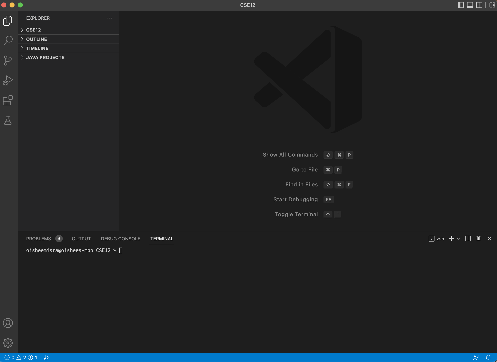
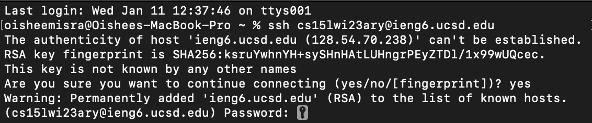
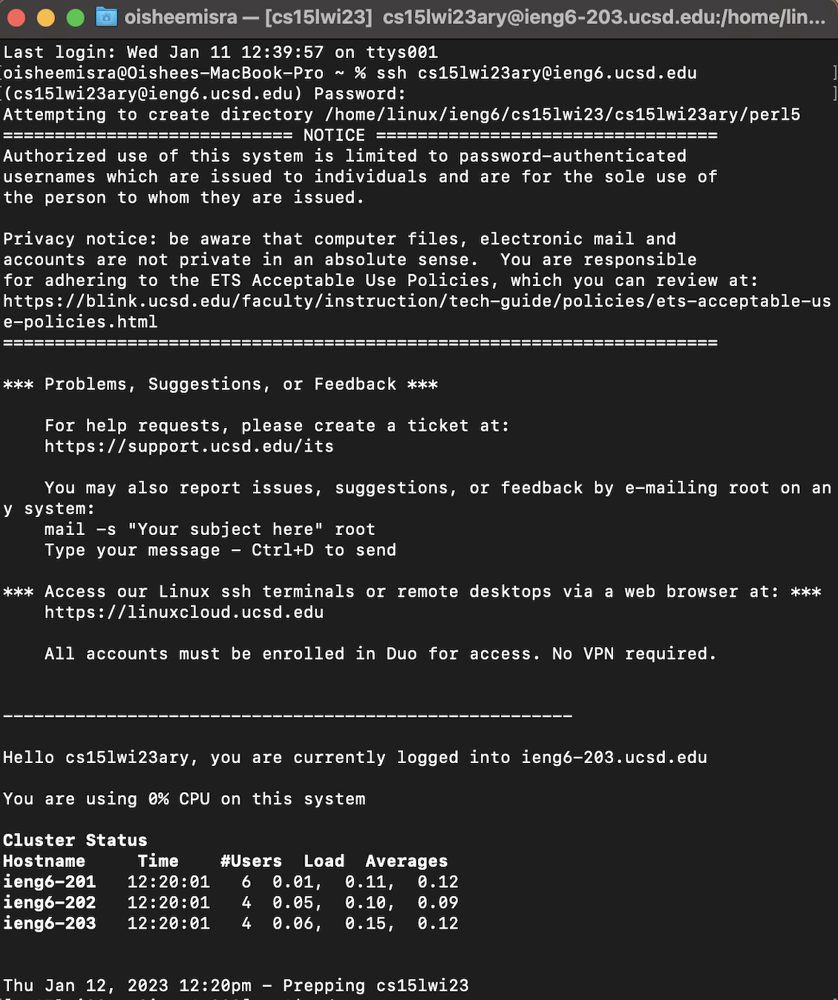
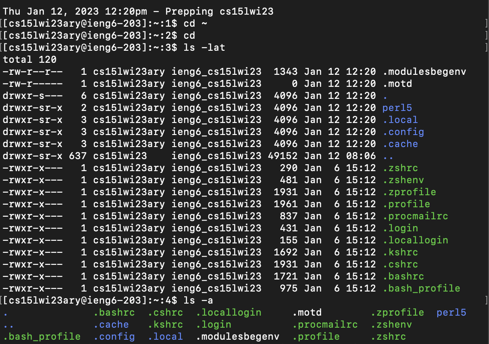
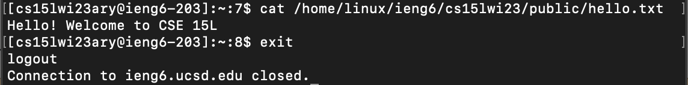

# Week 1 Lab Report: CSE 15L

**In this tutorial, we will go over three components of accessing a course-specific account on `ieng6`. These components include:**
- Installing VScode
- Remotely Connecting
- Trying Some Commands

## Installing Visual Studio Code
1. Visual Studio Code, or VSCode, is a useful text editor. It is compatible with major operating systems, including OSX (used by Mac) and Windows (used by PCs).
2. To download VSCode onto your device, go to the VSCode [website](https://code.visualstudio.com/) and follow the directions there. 
3. After installment, you can open up VSCode on your device. It should look like the screenshot attached below (the screenshot is in dark mode, but yours may be in light mode).

---	
## Remotely Connecting
1. To connect to a remote server, you must first look up your CSE 15L account on Educational Technology services [website](https://sdacs.ucsd.edu/~icc/index.php).
2. It may prompt you to change your password. Follow the tutorial on [this](https://docs.google.com/document/d/1hs7CyQeh-MdUfM9uv99i8tqfneos6Y8bDU0uhn1wqho/edit?usp=sharing) document to reset your password, and then wait for approximately 15 minutes.
3. After you have reset your password, open up the terminal on your computer. 
4. Type in `$ ssh cs15lwi23zz@ieng6.ucsd.edu` onto your terminal. Then, you will likely get an authenticity of host message (as shown in the image below). Type in yes, and then you will be prompted to enter your password.

5. Then, you will be connected to a remote server (as shown in the image below). We can now try some commands.

---	
## Trying Some Commands
1. The image below shows examples of some commands. 
2. If you type `cd ~`, it returns to the home directory.
3. If you type `cd`, it changes from the current directory to the specified directory. Note that cd stands for change directory.
4. If you type `ls -lh`, it displays all the information about each file in the directory.  
5. If you type `ls -a`, it displays all the hidden files in the directory.
6. Note that there are many other commands you can try, including `pwd, mkdir, and cp`.

7. We can also try opening the contents of a text file. The image below shows what happens if you type `cat /home/linux/ieng6/cs15lwi23/public/hello.txt`. 
8. If you want to exit the remote server, type `exit` and you will be logged out of the remote server. 

 

