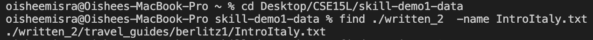
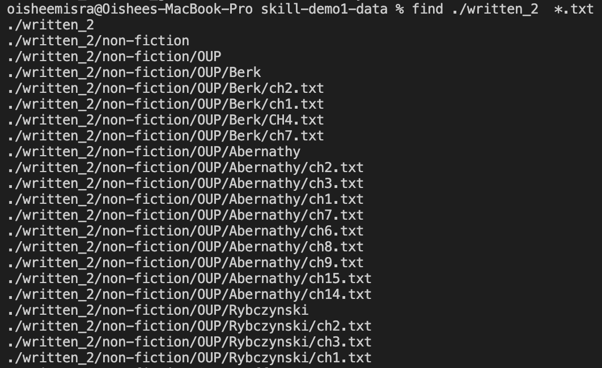
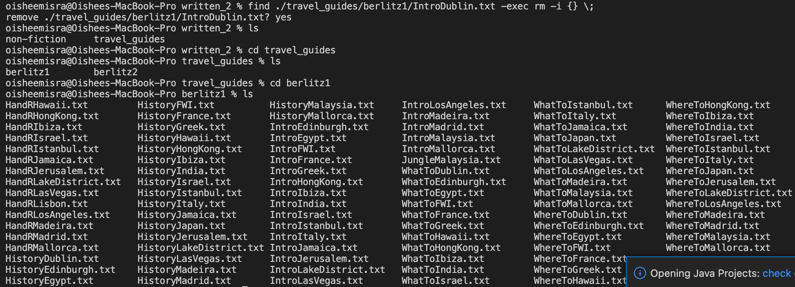
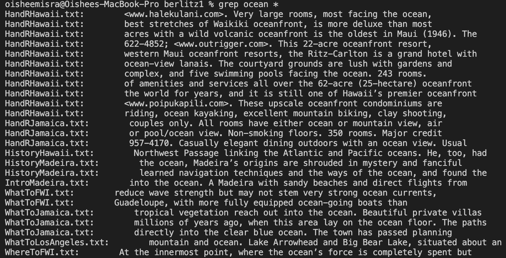
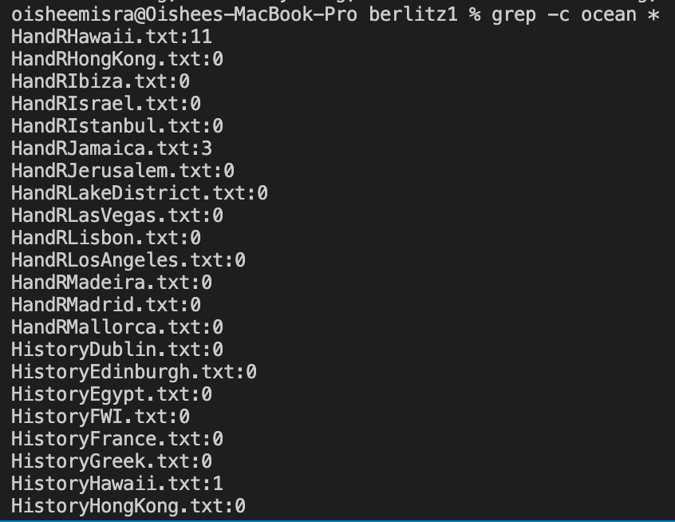

# Week 10 Lab Report: CSE 15L

**In this report, I will explain and provide examples of different command line arguments to use with the commands `find` and `grep`.**

## General Overview of `find` and `grep`
The `find` command, as the name suggests, is mainly used to find certain files and directories quickly. The `grep` command, which stands for 
“global regular expression print,” is used mainly to search for certain words or ohrases in text files. Both these commands are helpful in terms of 
speeding up tasks. Like my Week 5 lab report, I used the data from the github repository found on [this](https://github.com/ucsd-cse15l-w23/skill-demo1-data) link. 
The sources I used to find uses of the `find` and `grep` commands were the following websites: [GeeksforGeeks](https://www.geeksforgeeks.org/find-command-in-linux-with-examples/), 
and [phoenizNAP](https://phoenixnap.com/kb/grep-command-linux-unix-examples#:~:text=To%20search%20multiple%20files%20with,separated%20with%20a%20space%20character.&text=The%20terminal%20prints%20the%20name,as%20many%20filenames%20as%20needed.).

---

## Using `find`

---

## Using `less`

