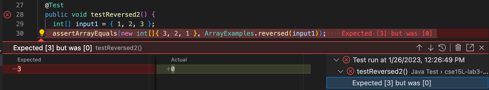
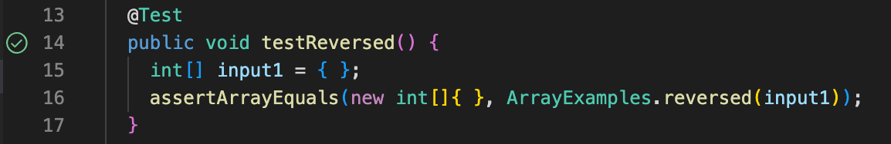
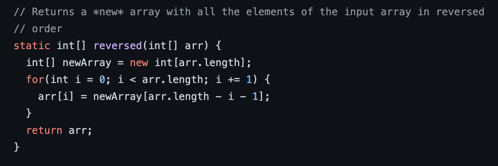
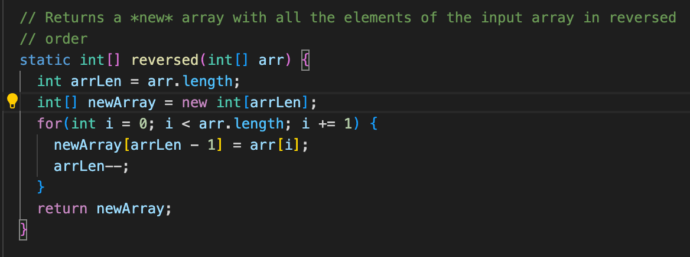

# Week 3 Lab Report: CSE 15L

**In this report, I will describe three components of lab, including:**
- Coding a web server called StringServer that stores messages
- Debugging a method from an array implementation
- Reflecting on the new things I've learned from 15L recently

## Coding StringServer
I coded a web server called StringServer, which stores values inputted by the user and prints them out line by line. I've attached a screenshot of my code below:

In the main method, the start method is called, `Server.start(port, new Handler());`, which takes in the port number (any number between 1024 to 49151) and creates a new Handler object. 
In the Handler class, the `handleRequest(URI url)` method is called, which takes in a URL. This method does most of the work in my program. 
It reads in the user input after the "=" and adds it to an ArrayList, and then prints out all the strings in the ArrayList. Each time a user types in
a string, it reads that string and stores it in the ArrayList, so the `parameters[1]` value changes each time, as seen in lines 9 and 10. 

To run my code, I typed in `java StringServer 4000` into my terminal. Then, the terminal gave me a message saying:
`Server Started! Visit http://localhost:4000 to visit.` 

I went to the listed URL and typed /add-message?s=hello. This called the handleRequest method in my code (the parameter is an URL, and this case my URL was 
http://localhost:4000),
which called the `.getQuery()` and `.split()` methods. Then, my code was able to read "hello," since it split after the "=". "hello" was read from `parameters[1]`
and printed out. This output can be seen in the screenshot below. 

Then, I typed in /add-message?s=Oishee. My code called the same methods as last time (and the URL remained the same as well), but this time "Oishee" was read from `parameters[1]`. Also, since "hello" was 
previously stored in the ArrayList, it printed out both "hello" and "Oishee" when it printed out the list, as seen in the screenshot below.

---	

## Debugging `static int[] reversed(int[] arr)` 

A failure-inducing input for the buggy program, as a JUnit test and any associated code (write it as a code block in Markdown)

An input that doesn’t induce a failure, as a JUnit test and any associated code (write it as a code block in Markdown)

The symptom, as the output of running the tests (provide it as a screenshot of running JUnit with at least the two inputs above)

The bug, as the before-and-after code change required to fix it (as two code blocks in Markdown)

---	

## Reflection

I better understand how to use JUnit.
