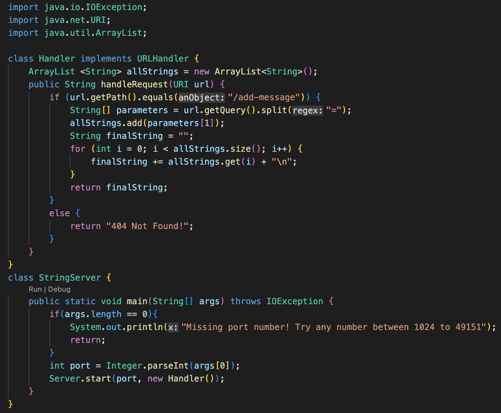
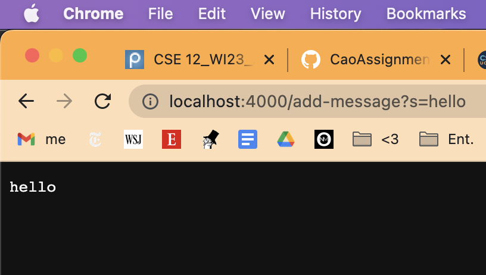
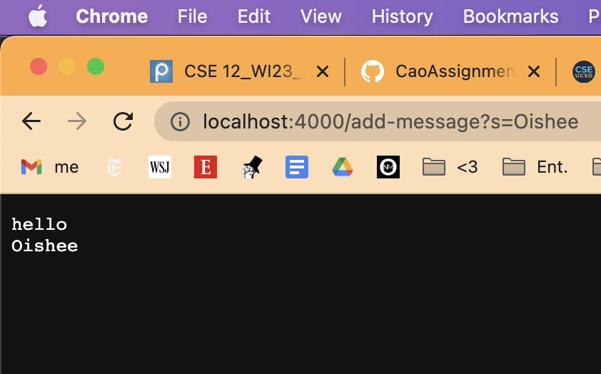
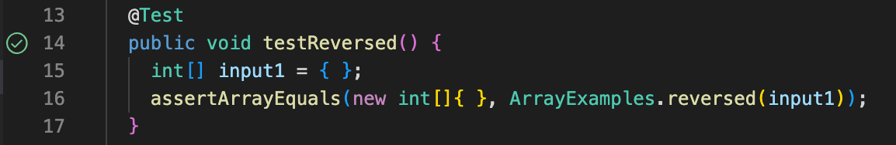
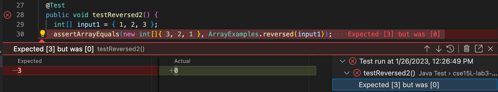
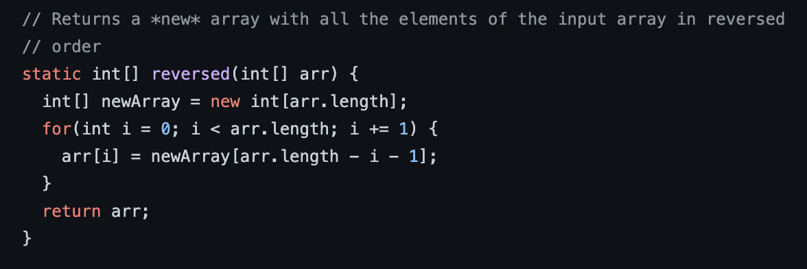
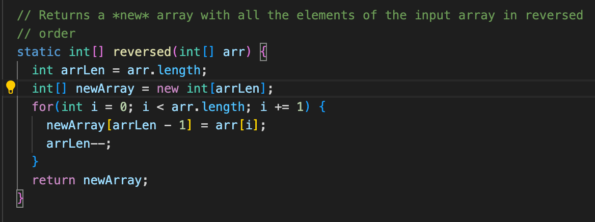

# Week 3 Lab Report: CSE 15L

**In this report, I will describe three components of lab, including:**
- Coding a web server called StringServer that stores messages
- Debugging a method from an array implementation
- Reflecting on the new things I've learned from 15L recently

## Coding StringServer
I coded a web server called StringServer, which stores values inputted by the user and prints them out line by line. I've attached a screenshot of my code below:

In the main method, the start method is called `Server.start(port, new Handler());`, which takes in the port number (any number between 1024 to 49151) and creates a new Handler object. 
In the Handler class, the `handleRequest(URI url)` method is called, which takes in a URL. This method does most of the work in my program. 
It reads in the user input after the "=" and adds it to an ArrayList, and then prints out all the strings in the ArrayList. Each time a user types in
a string, it reads that string and stores it in the ArrayList, so the `parameters[1]` value changes each time, as seen in lines 9 and 10. 

To run my code, I typed in `java StringServer 4000` into my terminal. Then, the terminal gave me a message saying:
`Server Started! Visit http://localhost:4000 to visit.` 

I went to the listed URL and typed /add-message?s=hello. This called the handleRequest method in my code (the parameter is an URL, and this case my URL was 
http://localhost:4000),
which called the `.getQuery()` and `.split()` methods. Then, my code was able to read "hello," since it split after the "=". "hello" was read from `parameters[1]`
and printed out. This output can be seen in the screenshot below. 

Then, I typed in /add-message?s=Oishee. My code called the same methods as last time (and the URL remained the same as well), but this time "Oishee" was read from `parameters[1]`. Also, since "hello" was 
previously stored in the ArrayList, it printed out both "hello" and "Oishee" when it printed out the list, as seen in the screenshot below.

---	

## Debugging `static int[] reversed(int[] arr)` 

I debugged the method `static int[] reversed(int[] arr)`, whose goal was to reverse the elements of the inputted array. 

1. A failure-inducing input (an int array containing 1, 2, and 3) for the buggy program, as a JUnit test and any associated code is shown below (the test failed with the original code):

`@Test
  public void testReversed2() {
      int[] input1 = {1, 2, 3};
      assertArrayEquals(new int[]{3, 2, 1}, ArrayExamples.reversed(input1));
  }`
 
2. An input (an empty array) that doesn’t induce a failure, as a JUnit test and any associated code is shown below (the test passed with the original code):

`@Test
  public void testReversed() {
    int[] input1 = { };
    assertArrayEquals(new int[]{ }, ArrayExamples.reversed(input1));
  }`

3. The following screenshots demonstrate the output behavior of the original methods (which contained bugs). The first screenshot shows a failed JUnit test. The method did not reverse the array correctly, and although it was expected that the output would be {3, 2, 1}, the test found a mismatch at element 0. The second screenshot shows a passed JUnit test. The input array was empty, and reversing an empty array is expected to output an empty array as well, which the method was able to do. 

4. Initially, the method had a bug in the line `arr[i] = newArrav[arr.length - i - 1]` because by assigning arr[i] (the original array) to an element in the new array, the original array was being overwritten. Therefore, the reversal was not happening correctly. I fixed this issue by replacing that line with `newArray[arrLen - 1] = arr[i];`. This way, the original array would not be overwritten. I also decremented arrLen (the length of the original array) after this so that the new array's elements would not get overwritten either and the reversal would take place correctly. Below I have attached ascreenshots of the initial code with bugs (first screenshot) and my new code that fixed the bugs (second screenshot). 

---	

## Reflection

Through Lab 2 and Lab 3, as well as course content in CSE 12, I have been introduced to and learned how to use JUnit. I find JUnit really helpful in terms of testing specific aspects of my code, so I can better pinpoint the sections with bugs. Additionally, I find that writing tests (even before writing my code) is really helpful because it helps me better understand what I'm trying to do and how to go about implementing it. 
