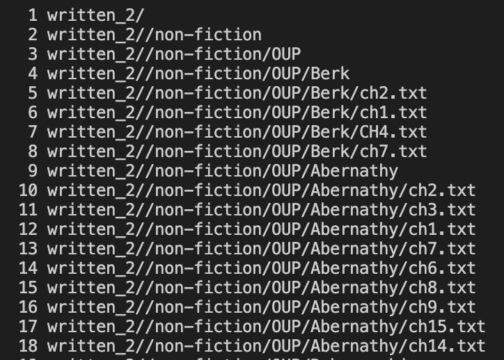
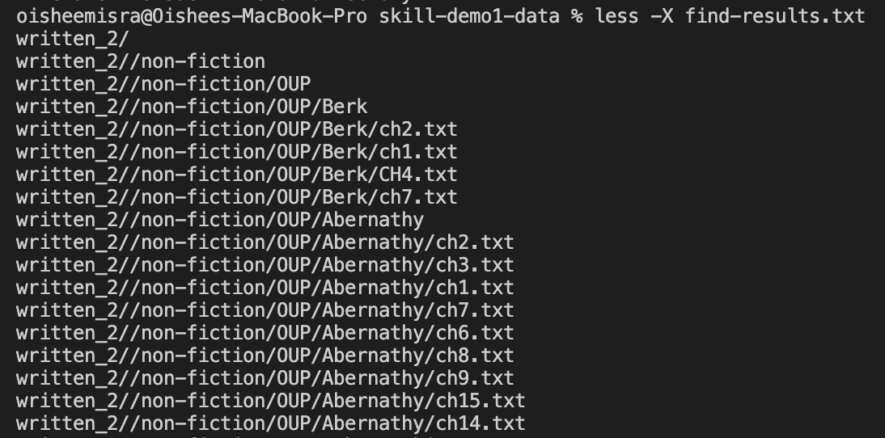
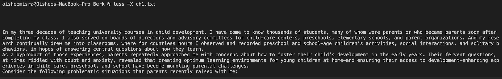
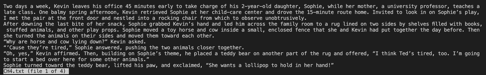
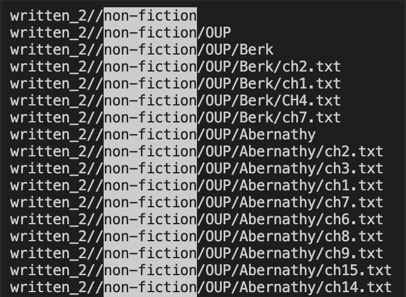
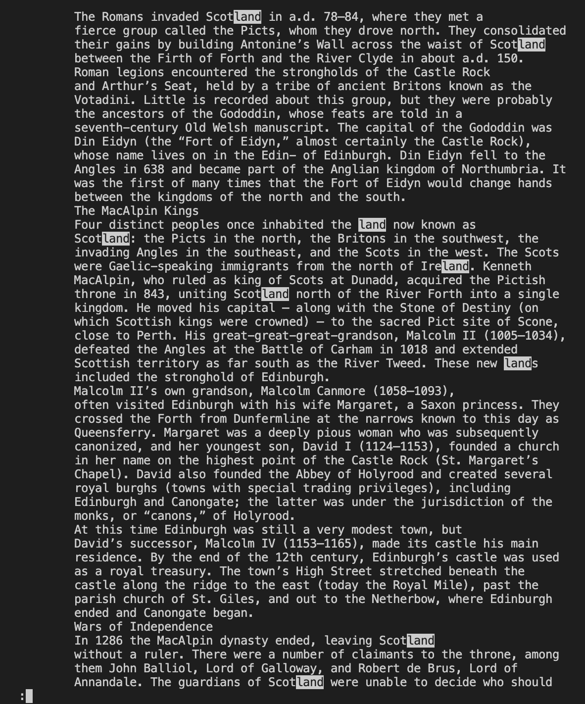

# Week 5 Lab Report: CSE 15L

**In this report, I will explain and provide examples of four different command line arguments to use with the command `less`.**

## General Overview of `less`
The syntax for using the `less` command is `less filename`. After typing that into the command line, you can browse the contents of the text file. 
When you want to quit, you can type `q` and it will exit out of the file. For the four examples of using `less` that I will provide below, I used the data from the
github repository found on [this](https://github.com/ucsd-cse15l-w23/skill-demo1-data) link. The sources I used to find special uses of the `less` command
were the following websites: [Linuxize](https://linuxize.com/post/less-command-in-linux/), 
[The Geek Stuff](https://www.thegeekstuff.com/2010/02/unix-less-command-10-tips-for-effective-navigation/), 
and [Linux Handbook](https://linuxhandbook.com/less-command/).

---

## Using -N with `less`
If you type `less -N filename`, the results will have line numbers on the left. For example, after I cloned the data repository, I typed:
`find written_2/ > find-results.txt`, and then
`less -N find-results.txt`
This gave me the following result with line numbers on the side: 

This is useful especially if you have a very long text file because you can keep track of where you are in the text. However, note that this can only be used
for text files. For example, I typed in `less -N written_2` and the output I got was `written_2 is a directory`. 

---

## Using -X with `less`
Another useful command to use with `less` is `less -X filename`. Normally, without the `-X`, the `less` command works as described previously, but when you type
`q`, the results disappear from the terminal. However, if you type `less -X filename`, the data it prints out stays there even after you quit. To test this,
I tried it with my data. I typed `less -X find-results.txt`. and the results stayed on the terminal after I quit, as seen in this screenshot:

This is particularly useful if you wanted to read through a specific file carefully, and did not need to mark it with anything. For example, I went through
the directory using a file pattern. I typed `cd written_2/non-fiction/OUP/Berk` to get to a directory with a bunch of book chapters, and then typed `less -X
ch1.txt`. This printed out the entire chapter onto my terminal, as seen in this screenshot:

---

## Opening multiple files with `less`
Additionally, you can look through multiple files using the `less` command if you use the syntax `less filename1 filename2`. For example, I tried typing in
`less written_2 find-results.txt`. The same rule as before applies where I can only use less on .txt files, so the output it gave me was `written_2 is a directory
Press RETURN to continue`. I pressed return and was able to parse through the `find-results.txt` file. 

This works on multiple files as well. I changed directories by typing in `cd written_2/non-fiction/OUP/Berk` and then typed `less CH4.txt ch1.txt ch2.txt ch7.txt`.
As seen by the screenshot below, I was able to parse through four different files. This is useful because it allows you to only type in one command instead
of typing four different ones (especially when you already know the series of files you want to look at). 

---

## Finding patterns while using `less`

After using the `less` command, you can find specific words or phrases within the file by typing `/pattern` because it will then highlight that specific word
or phrase. I tried to do this by first typing `less find-results.txt`. Once the command was executed, I typed in `/non-fiction` at the bottom, and all the 
lines in the .txt file that had non-fiction in their paths got highlighted, as seen in the screenshot below. 

I think this command is particularly useful if you're looking for a specific word/phrase in a lengthy text file because it means you don't have to read
or even skim the file; you can directly go to a relevant section by looking at the highlights. I tried this by searching for `/land` in the ch1.txt file, and the results can be seen in the screenshot
below:

