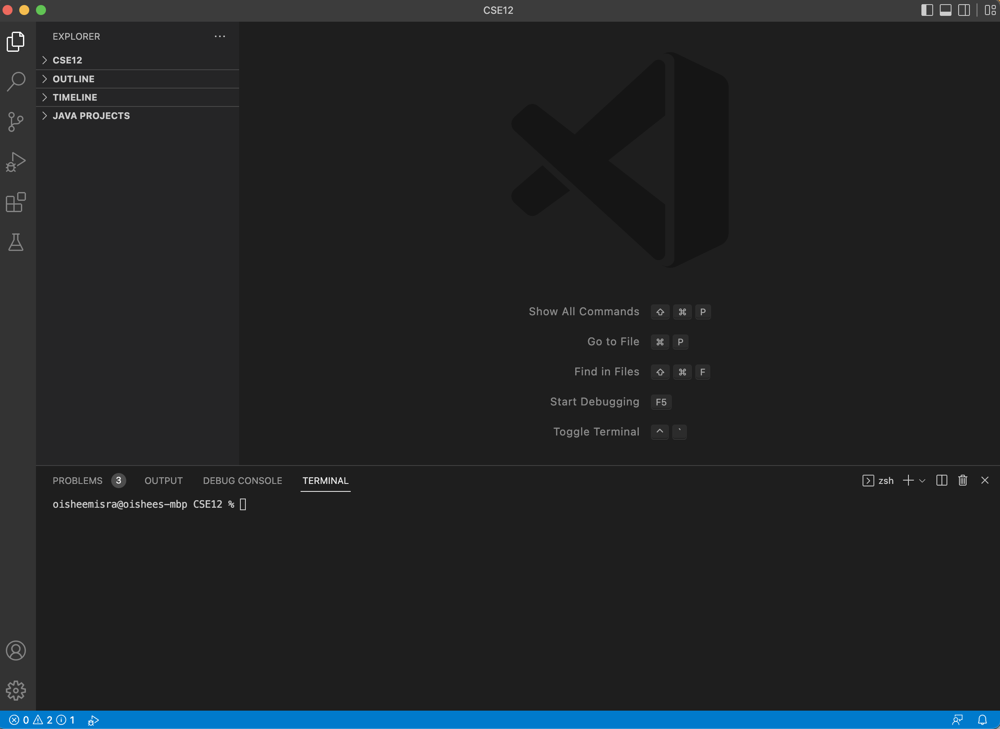

# Week 7 Lab Report: CSE 15L

**In this lab report, I will go over how to quickly complete complete the tasks given to us during lab this past week.**

## Initial Set-Up
In order to set up, I first forked the Lab 7 [repository](https://github.com/ucsd-cse15l-w23/lab7). Additionally, I generated SSH keys for my ieng6
remote account and my Github account so I didn't have to type in my passwords.

---	
## Tasks

### 1. Log into ieng6

### 2. Clone your fork of the repository from your Github account
### 3. Run the tests, demonstrating that they fail
### 4. Edit the code file to fix the failing test
### 5. Run the tests, demonstrating that they now succeed
### 6. Commit and push the resulting change to your Github account (you can pick any commit message!)
