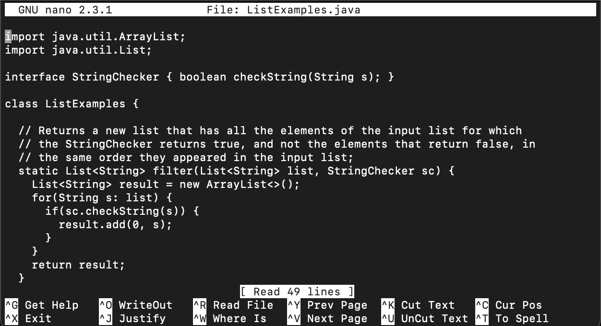

# Week 7 Lab Report: CSE 15L

**In this lab report, I will go over how to quickly complete complete the tasks given to us during lab this past week.**

## Initial Set-Up
In order to set up, I first forked the Lab 7 [repository](https://github.com/ucsd-cse15l-w23/lab7). Additionally, I generated SSH keys for my ieng6
remote account and my Github account so I didn't have to type in my passwords. I also copied the JUNit compile and run commands onto my computer's Notes app so that I would have easy access to them. The instructions and screenshots demonstrating the instructions are below. 

---	
## Tasks

### 1. Log into ieng6
First, I logged into my ieng6 remote server account by typing in `ssh cs15lwi23ary@ieng6.ucsd.edu`. Since I generated an ssh key, I did not have to
type in my password. 

### 2. Clone your fork of the repository from your Github account
Then, I went to my [github](https://github.com/oisheenathmisra) account, where I had forked the lab7 repository. I clicked on the <>Code symbol, and
navigated to Local, and under it SSH. I copied the ssh link, and on my terminal, I typed `git clone [SSH link]`. 

### 3. Run the tests, demonstrating that they fail
After cloning, I typed `cd lab7` to go to the correct directory. Then, using links I had copied onto my Notes app, I compiled and ran the JUNit tests. 
To compile, I typed:
`javac -cp .:lib/hamcrest-core-1.3.jar:lib/junit-4.13.2.jar *.java`
To run, I typed:
`java -cp .:lib/hamcrest-core-1.3.jar:lib/junit-4.13.2.jar org.junit.runner.JUnitCore ListExamplesTests.java`
1 out of the 2 JUnit tests failed.

### 4. Edit the code file to fix the failing test
To fix the bug in my code file, I used the text editor nano. I typed `nano ListExamples.java` to open up the text editor. I scrolled down using my Mac's
scroll bar until I got to Line 43. I pressed the right key six times, typed `index2`, pressed the right key 6 times, and the pressed the left key 6 times
to delete `index1`.
Then, I did ctrl-O, <enter> (to save), and ctrl-X (to exit the file).

### 5. Run the tests, demonstrating that they now succeed
I had to recompile and run the JUNit test file. To do so, I pressed the <up> key three times (since the compile command was three times up in my search history) and <enter> to run the command. I pressed the <up> key two times (since the run command was two times up in my search history) and pressed <enter> to run the tests. Now, both the tests passed.

### 6. Commit and push the resulting change to your Github account (you can pick any commit message!)
To commit and push the resulting changes to my Github account, I typed `git add ListExamples.java` and `git commit -m “fixed code”`. After this, I was done with the task! If I wanted to practice again, I could do `cd~` to get back to the main directory and then `rm -rf lab7` to delete the lab7 folder so I could reclone and practice again. 
 
